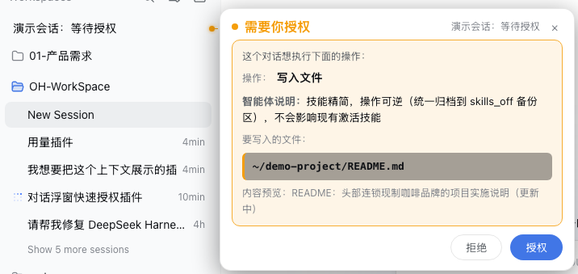
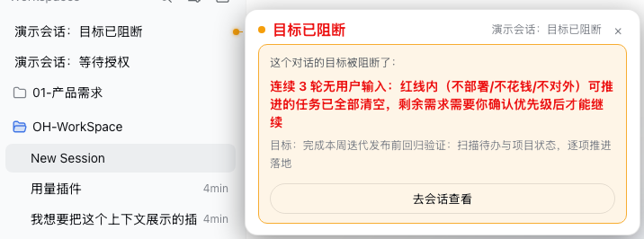

# dsh-hover-approve

DSH Web「侧边栏锚定气泡」：会话需要你**授权 / 选择 / 确认计划 / 目标被阻断**时，在左侧会话列表那一行右侧自动弹出气泡（带引线圆点连到该行），气泡里直接处理，**不用点进会话**。

## 四种模式

| 模式 | 触发条件 | 气泡内容 | 操作 |
|---|---|---|---|
| 🟠 **需要你授权** | 会话请求权限（写文件/跑命令等） | 操作类型、**要写入的文件**（高亮块）、命令（单行截断可展开）、智能体说明 | 拒绝 / 授权 |
| 🟠 **需要你选择** | askUserQuestion 提问（单选/多选） | 问题文本、选项列表（推荐项 ⭐ 高亮） | 点选项即答（单选）/ 勾选后确认（多选） |
| 🟠 **需要你确认计划** | plan-review 计划确认 | 计划详情、批准/拒绝选项 | 点选项即答 |
| 🔴 **目标已阻断** | goal 目标进入 blocked 阶段 | 阻断原因（红色大字）、目标内容 | 纯通知（× 关闭，可去会话查看） |

## 效果

> 真实 DSH Web 界面演示（会话行右侧锚定气泡，引线 + 圆点连到对应会话）：





- 有交互需求时**自动弹出**（不用悬停），锚定在会话行右侧，一条引线 + 圆点连接——一眼看出是哪个会话；
- 气泡**完整展示关键信息**：操作类型（工具名大白话：bash→运行终端命令、write→写入文件…）、文件路径高亮块、命令（默认单行截断，点击展开全文）、智能体说明（重点显示）、问题/选项/计划详情；
- 点气泡外部任意区域关闭（或 × 按钮），关闭后本轮不再弹，新一轮交互重新弹出；
- 会话列表滚动 / 行重渲染 → 气泡和引线跟随行位置；
- 多个会话同时有交互 → 各自锚定自己的行，横向错开；
- 多问题批次 / 无选项文本题 → 气泡提示「去会话查看」，点击打开会话。

## 原理

- **自动弹出 + 锚定**：订阅 `ctx.sessions.list`，`interactionOf()` 派生每个会话的交互类型（approval / question / plan-review / goal-blocked / none），从无到有或类型切换时延迟 350ms 弹出；行定位用实时 `getBoundingClientRect()`（`[role="treeitem"]` 按标题评分匹配），滚动 / resize / DOM 变化（MutationObserver + rAF）时重新锚定，行暂缺时递归重试最多 6 次。**归档会话不弹通知**：同时订阅 `ctx.workspaces.list`，把 `archivedSessionIds`（registry 全局归档集）里的会话排除——已归档的旧对话不再弹任何气泡，归档/取消归档即时生效（已弹的立即收起）。
- **权限内容**：`ctx.sessions.binding(id).session.getSnapshot()` 里找对应 `PendingWait`：
  - approval：`toolName` / `reason` 来自 `approval/requested` 帧 payload；命令通过 `callId` 在 `runningCalls` 匹配解析 `argsRaw.command`；**要写入的文件**从 write/edit 类工具 `argsRaw` 的 `file_path`/`path` 提取（附内容预览）；
  - question / plan-review：`question/requested` 帧的 `questions` 数组（问题/选项/详情），plan-review 用与内置面板一致的收窄规则识别（单问题 + plan-review intent + detail + 单选 + ≤2 选项 + approve 标签）。
- **响应**：走官方 `PendingWait.respond()` 通道（与会话内面板完全相同的客户端协议，服务端同一路径处理、有审计）：
  - approval：`{ sessionId, approvalId, outcome: 'allowed-once'|'rejected' }`——**approvalId 绑定展示时捕获的那个**，审批被替换/处理后会拒绝发送，杜绝「所见非所批」；
  - question：`{ sessionId, answer: { answers: [{ id, selected: [label], ... }] } }`。
- **goal-blocked**：读取列表快照 `summary.projectionValues.goal.goal.phase === 'blocked'`，展示 `blockedReason.message`。

## 文件

```
dsh-hover-approve/
├── package.json        # dsh.client 声明 + dsh.bundle.patch + npm test
├── index.js            # node half（空 apply，仅占 Loader 位）
├── lib/client.js       # 浏览器 half（手写 bundle，无需打包器）
├── cordis.patch.yml    # 挂载行：- id: dsh-hover-approve
└── test.mjs            # jsdom 端到端测试（16 用例）
```

## 安装

```sh
# 在 profile（如 ~/.dsh/profiles/web）里：
# 1. package.json dependencies 加：
#    "dsh-hover-approve": "file:/path/to/dsh-hover-approve"
# 2. dsh.profile.bundles 加 "dsh-hover-approve"（自动应用 cordis.patch.yml）
pnpm install
# 3. 重启 dsh web
```

> 注意：pnpm 的 `file:` 依赖在 node_modules 里是**拷贝**，改源码后需要手动同步：
> `cp <src>/lib/client.js ~/.dsh/profiles/web/node_modules/dsh-hover-approve/lib/client.js`

**从 GitHub 安装**（社区用户）：

```sh
# 在 profile 的 package.json dependencies 加：
#    "dsh-hover-approve": "https://github.com/wydddddcool/dsh-hover-approve"
pnpm install
# 并在 dsh.profile.bundles 加 "dsh-hover-approve"，重启 dsh web
```

兼容性：`peerDependencies` 显式覆盖 `@deepseek-ai/dsh-client-runtime` 的 `0.1.0-rc.x` 预发布分支（见 `|| >=0.1.0-rc.1` 分支）——`dsh plugin add` / pnpm 解析不会因预发布标签被静默排除。

## 测试

```sh
npm install   # 首次：安装 jsdom
npm test      # 16 个用例：四种模式、归档过滤、应答编码、状态切换、重试、视口钳制、卸载清理
```

## 兼容性

- 实测于 **dsh 0.1.0-rc.6**（依赖 `pendingInteraction` / `projectionValues` / `sessions.open` / `PendingWait` 等客户端 API）。
- 卸载方式：从 profile 移除 bundle 条目 + 依赖，重启即可，插件卸载无残留（定时器/监听/样式全部清理）。

## 局限

- 命令只在 `callId` 匹配到 running call 时显示（bash 类工具）；非 bash 工具只显示操作类型和说明——与内置面板行为一致。
- 行→会话映射靠标题评分匹配（精确匹配优先），极端重复标题仍可能错锚（概率极低）。
- 气泡依赖内置 HoverCard/列表 DOM 结构（`[role="treeitem"]`、portal 定位）。DSH 升级若改动该结构，气泡可能静默失效（不报错），届时需适配。
